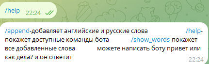
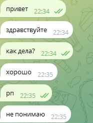
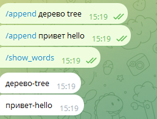
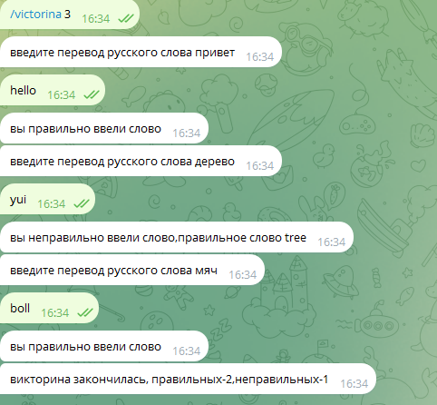

# Бот для изучения английского языка
Бот, созданный для изучения английского языка.
## Возможности бота
- С помощью команды /append можно добавить новые русские и английские слова.
- С помощью команды /help можно узнать все доступные команды бота.
- С помощью команды /show_words можно посмотреть все добавленные Вами слова.
- С помощью команды /victorina можно попрактиковаться в своих знаниях,а в конце бот покажет результат.
- Можно написать боту "привет" или "как дела?" и он ответит.
## Чему научилась
- Понятие чат-ботов и их регистрация.
- Уникальный токен бота и подключение к боту через Python.
- Стандартная структура программы для управления ботом.
- Обработка любых сообщений от пользователя.
- Раздельное хранение слов многих пользователей.
- Обработка дополнительных параметров, переданных вместе с командой.
- Постоянное хранение данных в JSON-файлах.
## Работа чат-бота
### Функция /help в чат-боте.

### Возможность бота отвечать на сообщения.

### Возможность бота добавить и показать добавленнные слова.

### Викторина.

